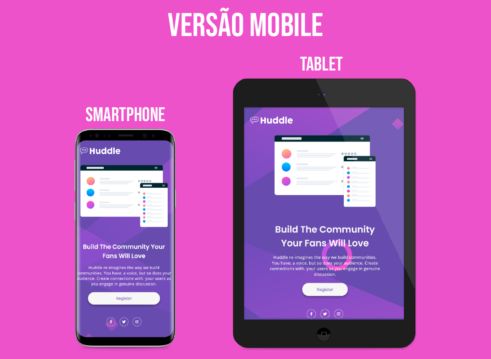

# Frontend Mentor - Página de destino Huddle com solução de seção introdutória única

Esta é uma solução para a [Huddle landing page with single introductory section challenge on Frontend Mentor](https://www.frontendmentor.io/challenges/huddle-landing-page-with-a-single-introductory-section-B_2Wvxgi0). Os desafios do Frontend Mentor nos ajudam a melhorar nossas habilidades de codificação ao construir projetos realistas. 

## Índice

- [Frontend Mentor - Página de destino Huddle com solução de seção introdutória única](#frontend-mentor---página-de-destino-huddle-com-solução-de-seção-introdutória-única)
  - [Índice](#índice)
  - [Visão Geral](#visão-geral)
    - [**O desafio**](#o-desafio)
    - [**Captura de tela**](#captura-de-tela)
    - [**Links**](#links)
  - [Meu processo](#meu-processo)
    - [**Construído com**](#construído-com)
    - [**O que eu aprendi**](#o-que-eu-aprendi)
    - [**Desenvolvimento continuado**](#desenvolvimento-continuado)
    - [**Recursos úteis**](#recursos-úteis)
  - [Autor](#autor)

## Visão Geral

### **O desafio**

Os usuários devem ser capazes de:

- Visualize o layout ideal para a página, dependendo do tamanho da tela do dispositivo
- Veja os estados de foco para todos os elementos interativos na página

### **Captura de tela**


<br><br>


### **Links**

- URL da solução: [Huddle landing page](https://your-solution-url.com)
- Site URL: [Huddle landing page](https://huddle-landing-page-competent.netlify.app/)

## Meu processo

### **Construído com**

- HTML5
- CSS
- Flexbox
- Animation CSS
- Mobile-first workflow

### **O que eu aprendi**

Neste desafio pude fixar muitos conhecimentos em CSS.<br>
Para definir a largura máxima da minha **div content** que engloba toda minha estrutura **HTML**, utilizei a função [min()](https://developer.mozilla.org/en-US/docs/Web/CSS/min()) na propriedade **width** no código **CSS**.<br>
Exemplificando melhor defini uma largura de 90%, que fica bacaninha, mais em telas maiores minha página tentaria cobrir os 90% de toda a tela sempre, deixando o design feio e estranho. Então para corrigir esse problema usei a função **min()**, desta maneira além de passar os 90% pude definir uma largura máxima de 137rem que seria 2192px convertidos, para que em telas excedentes, ele limitasse a largura, então mantendo o design agradável e bonito.

Classe principal em minha estrutura HTML:

```html
<div class="content"> Aqui dentro vai a estrutura do site. </div>
```
Função **min()** utilizada na propriedade width:
```css
.content {
    width: min(137rem, 90%);
}
```

Para mais informações sobre a função **min()** acesse a [documentação MDN](https://developer.mozilla.org/en-US/docs/Web/CSS/min()).

### **Desenvolvimento continuado**

Para as próximas soluções, pretendo explorar técnicas mais atuais de CSS, assim como pude aplicar nesta com a função **min()**, além de me divertir mais com animações de forma sutil nas páginas sem fugir do objetivo principal, que é a boa apresentação.

### **Recursos úteis**

- [Propriedades Background](https://www.w3schools.com/cssref/css3_pr_background.asp) - Essa documentação me ajudou a entender e trabalhar melhor com as imagens nesta solução.
- [Função min()](https://developer.mozilla.org/en-US/docs/Web/CSS/min()) - Caso você não tenha passado pela sessão [o que eu aprendi](#o-que-eu-aprendi), nela falo sobre a função **min()**, que me ajudou com a largura máxima da minha página para telas maiores.

## Autor

- Frontend Mentor - [@300Marco](https://www.frontendmentor.io/profile/300Marco)
